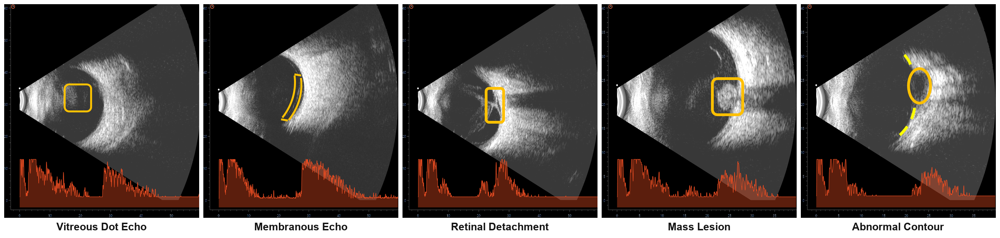

# Oculo: A Multilabel Dataset for Identification of Ocular Abnormalities from Ultrasound

Benchmark code for the MICCAI 2026 paper introducing **Oculo**, a publicly
available multi-label B-scan ocular-ultrasound dataset (1,630 images,
five annotated abnormalities) and a benchmark of four deep-learning backbones
and three domain-specific foundation models.

- **Dataset:** https://huggingface.co/datasets/SankaraEyeHospital/Oculo
- **Labels (5 evaluated):** Vitreous Dot Echo (VDE), Membranous Echo (ME),
  Retinal Detachment (RD), Mass Lesion (ML), Abnormal Contour (AC).
  Three additional rare labels (PVD, CD, Phthisis) are released but excluded
  from evaluation.

<p align="center"></p>
<p align="center"><em>Representative B-scan images for each annotated abnormality.</em></p>

---

## Models

| Setting | Models |
|---------|--------|
| Backbones (Table 3, single- & multi-task) | EfficientNet-B0, ResNet50, VGG-19-BN, ViT-B-16 |
| Foundation models (Table 4, Full-FT / Linear-Probe / LP&rarr;FT) | OpenUS, USFM, VisionFM |

CNNs train at 512x512; ViT-B-16 and the foundation models at 224x224.

---

## Repository layout

```
.
├── data.csv                 # image_id + 8 binary labels + diagnosis (1,630 rows)
├── splits/                  # fixed train/val/test split (CSVs)
│   ├── train.csv  val.csv  test.csv
├── src/
│   ├── train.py             # single training entry point (all models/settings)
│   ├── dataset.py           # multi-label B-scan dataset + transforms
│   ├── losses.py            # focal / BCE / asymmetric loss
│   ├── foundation_models.py # USFM / VisionFM / OpenUS loaders
│   ├── preprocess.py        # crop + resize released images for training
│   ├── aggregate_seeds.py   # per-seed metrics -> mean +/- std
│   └── figures/             # paper figure scripts (Fig 2, Fig 3)
├── assets/                  # figures embedded in this README
├── run_seeds.sh             # train all reported models over seeds 0-4
└── requirements.txt
```

---

## Setup

```bash
python -m venv .venv && source .venv/bin/activate   # (Windows: .venv\Scripts\activate)
pip install -r requirements.txt
# For GPU training, install a CUDA build of torch/torchvision from pytorch.org.
```

---

## Data

1. Download the dataset (1,630 PNG images + `data.csv` + `splits/`) from
   [Hugging Face](https://huggingface.co/datasets/SankaraEyeHospital/Oculo).
2. Preprocess the images for training:

   ```bash
   python src/preprocess.py --src path/to/images --dst data/images --size 512
   ```

`data.csv` and the `splits/` CSVs in this repo match the released dataset.

**Preprocessing.** The released images already have machine text overlays
(patient identifiers, timestamps, scan parameters) removed — via HSV color
masking + Navier-Stokes inpainting, with the diagnostic A-scan waveform
preserved — so they contain **no burned-in identifiers**. `src/preprocess.py`
then removes residual UI borders with a size-dependent crop (top 20% / bottom
6% / left 9% / right 20%) and resizes to the training resolution. CNNs train at
512×512; ViT-B-16 and the foundation models resize the same images to 224×224 at
load time, so a single preprocessed set serves every model.

---

## Training

Single entry point, `src/train.py`. Examples:

```bash
# Multi-task, full fine-tuning (5 labels)
python src/train.py --model efficientnet_b0 --experiment-tag mt_fullft \
    --exclude-classes pvd,cd,phthisis --seed 0

# Single-task (one binary model per label)
python src/train.py --model resnet50 --experiment-tag st_fullft_rd \
    --single-task rd --seed 0

# Foundation model: linear probe / LP->FT
python src/train.py --model usfm --experiment-tag mt_lp \
    --exclude-classes pvd,cd,phthisis --freeze-backbone --seed 0
python src/train.py --model usfm --experiment-tag mt_lpft \
    --exclude-classes pvd,cd,phthisis --freeze-backbone --unfreeze-epoch 10 --seed 0
```

Each run writes metrics, predictions, confusion matrices, and a checkpoint to
`results/<model>__<tag>/`. Training uses focal loss (γ=2.0), AdamW (lr=1e-4,
weight-decay=1e-4) with a cosine schedule, batch size 8, and up to 50 epochs
with early stopping.

Reported numbers are the mean over seeds 0–4 on the fixed split:

```bash
bash run_seeds.sh                                      # train all models, seeds 0-4
python src/aggregate_seeds.py --results-dir results    # aggregate to mean ± std
```

---

## Results

Single-task vs multi-task per-label F1 (EfficientNet-B0, left; ViT-B-16, right):

<p align="center">
  
  
</p>

Foundation-model linear probes vs EfficientNet-B0 (full fine-tuning), per label:

<p align="center"></p>

Regenerate these figures with:

```bash
python src/figures/plot_single_vs_multitask.py --out-dir assets   # EfficientNet + ViT
python src/figures/plot_fm_comparison.py --out-dir assets         # foundation models
```

---

## Foundation-model weights

The four backbone results need no external weights. The three foundation models
are evaluated from their official pretrained checkpoints (~2.8 GB total, not
stored in git). Download them into a local `pretrained/` directory:

| Model    | `--model`  | Architecture         | Default weight path                  |
|----------|------------|----------------------|--------------------------------------|
| USFM     | `usfm`     | BEiT ViT-B/16        | `pretrained/USFM_latest.pth`         |
| VisionFM | `visionfm` | ViT-B/16 (B-US enc.) | `pretrained/VisionFM_Ultrasound.pth` |
| OpenUS   | `openus`   | VMamba-Small (SSM)   | `pretrained/OpenUS_S.pth`            |

Override a path with `--pretrained-path /path/to/weights.pth`.

- **USFM** — Jiao et al., *Medical Image Analysis* 2024 (`USFM_latest.pth`).
- **VisionFM** — Qiu et al., *NEJM AI* 2024 (B-Ultrasound encoder checkpoint).
- **OpenUS** — Zheng et al., 2024 (OpenUS-S DINO teacher checkpoint).

USFM and VisionFM use standard `timm` ViT backbones. OpenUS uses a VMamba
state-space backbone and needs its source plus extra packages:

```bash
# clone the OpenUS repo into the project root so OpenUS/vmamba_models is importable
git clone <openus-repo-url> OpenUS
pip install mamba-ssm einops fvcore
```

---

## Citation

```bibtex
@inproceedings{oculo2026,
  title     = {Oculo: A Multilabel Dataset for Identification of Ocular Abnormalities from Ultrasound Images},
  booktitle = {Medical Image Computing and Computer Assisted Intervention (MICCAI)},
  year      = {2026}
}
```
